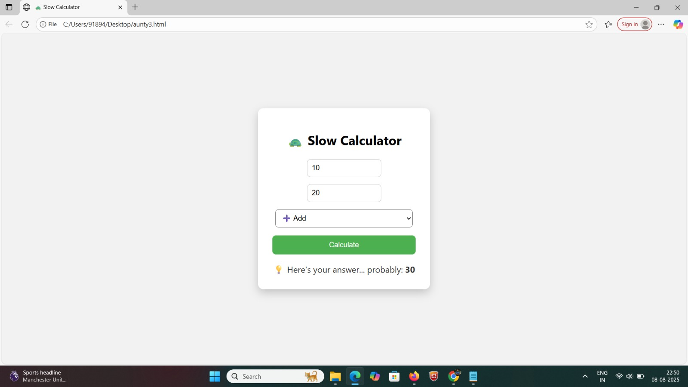

# [SLOW CALCULATOR] 🎯

## Basic Details
### Team Name: [THINKER HUBBERS]

### Team Members
- Team Lead: [M MALAVIKA] - [JYOTHI ENGINEERING COLLEGE THRISSUR]
- Member 2: [NIDHI RAJESH] - [JYOTHI ENGINEERING COLLEGE THRISSUR]
  

### Project Description
[2-3 lines about what your project does]

### The Problem (that doesn't exist)
[What ridiculous problem are you solving?]

### The Solution (that nobody asked for)
[How are you solving it? Keep it fun!]

## Technical Details
### Technologies/Components Used
For Software:
- [HTML,CSS,JAVASCRIPT]
- [BOOTSTRAP]
- [CODE EDITOR,VSCODE]

For Hardware:
- [List main components]
- [List specifications]
- [List tools required]

### Implementation
For Software:
# Installation
[Prerequisites
A web browser (Chrome, Firefox, Edge, etc.)
Visual Studio Code or any text editor (optional)]

# Run
[1. Locate the file: index.html
2. Open it in your browser:
Option 1: Right-click index.html → Open with Live Server (if Live Server extension is installed in VS Code)
Option 2: Double-click index.html to open in your default browser]

### Project Documentation
For Software:📘 Project Title
Slow Calculator
A simple calculator with intentional delay to simulate computational slowness.
🧠 Introduction
The Slow Calculator is a web-based project created using HTML, CSS, and JavaScript that performs basic arithmetic operations while introducing a short intentional delay before displaying the result. This project is designed for educational and experimental purposes to demonstrate the effect of lag, inefficient processing, and user experience with delayed outputs.
🎯 Objective
To simulate computation delay in a calculator interface.
To help learners understand how processing time and inefficient algorithms affect system performance.
To explore UI responsiveness and real-time feedback behavior.
🧱 Technologies Used
Technology	Purpose
HTML5	Structure of the calculator
CSS3	Styling and layout
JavaScript	Functionality and delay logic
🚀 Features
Simple and responsive calculator UI
Performs:
Addition
Subtraction
Multiplication
Division
Adds a delay (e.g., 2 seconds) before showing the result
Designed to mimic real-world lag or heavy processing

⚙️ How It Works
User inputs values and selects an operation.
JavaScript function is triggered to:
Wait (using setTimeout) for a few seconds.
Then display the result.
Delay duration can be customized for different simulation levels.
🛠️ Installation & Running the Project
Prerequisites:
A modern web browser
(Optional) VS Code with Live Server extension

# Screenshots (Add at least 3)

This is the initial delay stage just after starting the calculation.
Same input values are present (10 + 20).
The Calculate button has been pressed, and it now says:
> Thinking…

This is the earliest stage in the waiting process before the next message “Still thinking…” appears, leading up to the final answer.

.jpeg)

*Add caption explaining what this shows*

# Diagrams

*Add caption explaining your workflow*

For Hardware:

# Schematic & Circuit

*Add caption explaining connections*

*Add caption explaining the schematic*

# Build Photos

*List out all components shown*

*Explain the build steps*

*Explain the final build*

### Project Demo
# Video
[WhatsApp Video 2025-08-09 at 1.54.24 AM.mp4]
*This project simulates a "Slow Calculator" — a calculator that intentionally introduces a slight delay before displaying results. The main goal is to demonstrate the concept of computational delay and help learners understand how processing time or algorithm complexity affects output speed in real-world applications.Performs basic arithmetic operations: addition, subtraction, multiplication, and division.
Adds a deliberate lag (usually a few seconds) before showing the result.While the calculator works correctly and shows the result within a few seconds, the lag is intentional and is used to:
Simulate the effect of inefficient processing.
Help users appreciate the need for efficient algorithms.
Demonstrate delayed UI responsiveness, which is a common problem in real applications.
This behavior is useful for educational or experimental purposes rather than speed-focused computation.
🧪 Educational Value
This project serves as a simple but powerful tool to:
Teach the impact of time complexity.
Illustrate the concept of asynchronous processing.
Show how user experience is affected by even small lags.
💡 Customization
You can adjust the delay time to simulate different levels of slowness — from mild UI lag to extremely slow processing, depending on your teaching or demonstration needs.*

# Additional Demos
[Add any extra demo materials/links]

## Team Contributions
- [MALAVIKA M]: [My Contribution:Designed the user interface with simple input/output fields to enter numbers and display results.
Implemented the core calculation logic that performs arithmetic operations (addition, subtraction, multiplication, division).
Added deliberate delay logic to simulate the “slow” behavior of the calculator.
Tested the functionality to ensure correct results after the delay.
Documented the code and wrote the user manual.

- [NIDHI RAJESH]: [Assisted in defining project requirements and scope.
Developed the code to handle input validation and error handling (e.g., division by zero).
Created unit tests to check correctness of each operation.
Worked on improving code efficiency while maintaining the slow delay feature.
Helped with debugging and final project integration.]]

Made with ❤️ at TinkerHub Useless Projects 

